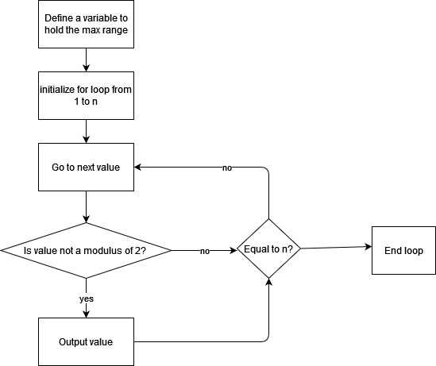

# Workbook Assesment

## **Q1. Research the development of the internet from 1980 to today. You must describe at least FIVE key events in the development of the internet.** <br></br>

During the peak of the Cold War, the United States were looking for a means of communication which would allow for information to be shared without a centralized hub to prevent their communications from being severed in one attack. In the late 1960’s ‘ARPANET’ was proposed, a network designed to implement packet switching to decentralize communication. Originally, the idea was first studied by Paul Baran in the early 1960’s and later was known as ‘packet switching’. The first computers to connect to this network were from Stanford UCLA on 29th of October 1969.

As advancements continued, email was introduced by Ray Tomlinson in 1971. The creation of email was designed as a from of electronic mail separated by an ‘@’ symbol to distinguish between the user and the machine. The separation of the user and computer made it possible for mail to be sent to a particular individual on a specified machine.

In the early 1970’s, an issue had been discovered when connecting networks together, each network was formatting their packets differently, making it difficult when connecting networks to one another. To resolve this issue the TCP/IP protocol was co-created by Vint Cerf and Bob Kahn in 1973. This protocol eventually became standardized so that all networks were structuring their packets the same. As ARPANET grew, and more networks began connecting to each other, they all became one interconnected network know as the internet.

In the early 1980’s there were an increasing number of websites connecting to the internet and each was assigned with its own unique IP address, which was represented as a series of numerical values. This made it increasingly difficult to keep track of what each websites domain was. To resolve this issue, Paul Mockapetris and his team set out to make a system that could replace the IP address with a domain name. As a result, the Domain Name system (DNS) was created in 1983. DNS uses four servers to load a webpage, DNS resolver, Root name server, TLD name server, and the authoritative name server. The DNS resolver will receive the request for a domain, if the resolver does not know the domain the request will be sent to the root name server. If the root name sever does not know of the domain, the request again will be sent to the TLD. The TLD server contains the address information of top-level domains such as, .com, .net, .org etc. Once the request if then sent to the authoritative server, the IP address for the requested server will be sent.

In 1989 Tim Berners-Lee first proposed the World Wide Web to CERN, explaining that it was in their best interest to pursue a global hypertext system. In 1990 Tim finished writing the code for the World Wide Web, as well as HTTP, HTML and URL. A year later in 1991 the first webpage was published on the World Wide Web to explain what it was. <br></br>

## **Q2. Define the features of the following technologies that are essential in terms of the development of the internet**<br></br>

### **Packets:**

Data packets were first proposed as an alternative to sending and receiving data over vast distances using dedicated connections for each computer. Instead, packet switching would allow for data to be divided into smaller packets which would contain, a piece of the data, as well as the IP addresses for the destination and where it was sent from. These packets would then each take paths through the network being directed by routers towards their destination. Packets have played an important role in the development of the internet, enabling information to be sent from one location to another despite any congestion within the network. If this were not the case, and a connection between two computers were disconnected then information/data would be lost.

### **IP Adresses:**

An IP (Internet Protocol) address is a unique identifier represented as a numerical value used to identify the location of a specific computer or server. When data is transmitted from one computer to another, the data being sent is directed to a unique IP address. IPv4 is an IP address that holds a 32-bit address, this means there are approximately 4 billion unique combinations of IP addresses, however this is not enough for every device to have its own address. IPv6 uses a 128-bit address, providing approximately 3.4 x 10^38 combinations. This is an important development for the internet, as the previous IPv4 would not provide enough addresses for the future of the internet. IPv6 will be crucial to compensate for an increasing population, new business and industries requiring unique server addresses, and as 3rd countries begin to modernize.

### **Routers and Routing:**

Routers are designed to direct the flow of data from one network to the next using the IP address of the data to determine if the data was intended for its own network or a separate network. If the router has determined that the data was not intended for its own network the router will then send the data to another network. The invention and implementation of routing and routers on the internet is a crucial part of how the internet can connect to each network. The internet is essentially a large-scale network connecting each network together without routers information could not be sent or received unless connected to a dedicated cable. <br></br>

## **Q3. Define the features of the following technologies that are essential in terms of the development of the internet (part 1)** <br></br>

### **TCP:**

TCP (transmission control protocol) is a standardized model used to enable computer devices and application programs to communicate to one another over a network. Its main purpose is to ensure that data packets are sent across a network to the correct location (IP address) while guaranteeing the integrity of that data. This guarantee of data integrity essentially means that the data being sent is accurate and consistent. Before the data is transferred across the network, the TCP protocol numbers each packet sequentially. Once the packets arrive at the IP address it was sent to the TCP/IP protocols reorganizes the data by using the number each packet was assigned to so that the information is accurate and in order. While each piece of data is being received the computer receiving the data sends back the checksum of the packet, which the sending computer will then acknowledge. If the original sending computer does not send back an acknowledgment that the data has been received, then the receiving computer will send the checksum a second time. The TCP/IP model is made up of four layers including, the physical layer, network layer, transport layer, and application layer. The application layer is the highest layer of the TCP model, and it handles protocols like http for visiting websites and smtp for emails. Once application layer then communicates with the transport layer using ports. This is when TCP takes effect, by dividing the data into packets to be sent across the network. After this, the data is pushed onto the internet/network layer where the IP is used to ensure that the data is sent to the right computer. Finally, the physical layer is what turns the data into electrical impulses to transmit the data across fiber optic cables.

### **HTTP/HTTPS:**

HTTP (hypertext transfer protocol) is an application layer protocol for use of transmitting hypermedia documents and files like HTML. It was created as a way for web browsers to communicate with servers but can also be used as a way of retrieving images, videos or posting content to a server. HTTP is known as a client-server protocol, meaning that requests are sent by the user-agent (usually by web browser) which then are received and processed by the sever to produce a response back to the user-agent. These requested are passed through different routers using the Transmission Control Protocol until the request reaches the server. In order to execute these requests http has many built in request methods two of which are used across all HTTP servers (HEAD, GET). As an example of how HTTP works, a person uses a web browser to open a website, which then prompts the application to send a request (using TCP) to the host web server to display the html page. Once the html document is retrieved the web browser collects the additional documents like images and the CSS files linked to the HTML file. HTTPS (hypertext transfer protocol secure) on the other hand works the same as HTTP but has some added features. HTTPS uses an extra layer to ensure a secure connection between the client and the server to prevent man-in-the-middle attacks (MITM). A MITM is a type of cyberattack in which data can be secretly intercepted by a third party to alter and manipulated the data. For this reason, HTTPS utilizes SSL/TLS to establish a secure connection between the client and server by responding to the request sent to the webserver with a public key certificate. This certificate is verified by a certificate authority and lets the client know that the certificate is authentic. After this, the client web browser creates a session key which is a key that uses symmetric encryption, however this symmetric key is then encrypted using the public key sent by the server. This establishes a highly secure network connection between the two computers.

### **Web browsers:**

A web browser is a type of application used to retrieve information from the world wide web. All web browsers have a URL bar at the top of the application which is what allows users to send a request for a specific web page. A URL link is formatted with a http protocol at the start which can be either http or https, followed by ‘www’ to access the world wide web and the domain name of the website. The browser then sends the request using http/https to retrieve and display the website. Using TCP/IP, the request is sent back across the network with all the necessary information to the user. In order to render the documents on the web client, the web browser uses a rendering engine. The rendering engine works by interpreting the HTML and/or XML documents and images with the CSS style sheets to layout the information of the client’s web browser. This is done breaking the process into two trees, the DOM used for storing data about the HTML elements and CSSOM used for the data used to style the HTML documents. These two structures are combined into one render tree and then goes to the layout process which calculates the exact positioning and sizing of all the elements. The final stage of the rendering engine is to ‘paint’ the information to the screen so that it is displayed on the web browser. Additionally, there are added tools for develops to inspect with the front-end code of a website using some features of the web browser. Though this is slightly different for every browser, this can be accessed by right clicking the web page and selecting ‘inspect’ which will display the html, css, images and additional styling information like padding and margins.<br></br>

## **Explain how each technology has contributed to the development of client and server communication over the internet (Q3 part 2)**<br><br>

### **TCP:**

Before TCP/IP had been established as the standard for communication over the internet ARPANET had become popular for transmitting data as more networks began connecting to it. However, not all systems were operating using the same protocols, and for this reason the TCP/IP protocol was created as a standard for communication. This is important because if there was no standard for communication across the millions of networks connected to the internet, client and server communication would be very difficult to establish. TCP was specifically designed to be implemented across all computers despite any differences in hardware or operating system being used. In addition to this, TCP can communicate with networks no matter what physical network hardware was being used, meaning it could connect networks using, Ethernet, optical network, a DSL connection and so on. For this reason, client and server communication relies heavily on using standardized protocols such as TCP to communicate with each other. TCP is also very important for server to client data transmission as it does not risk sending information with missing data.

### **HTTP/HTTPS:**

As a result of the creation of HTTP in 1997, internet users could more easily access other resources and websites through the use hyperlinks. Its contribution to client and server communication has allowed the information to be more easily accessible and allowed the for hypertext documents like HTML to be shared though the use of the protocol. Without it, clients and server would not be able to share information to each other. Later, there needed to be a more secure way for clients and servers to share information, which inspired the creation of HTTPS. As a result of its creation clients, and servers could share sensitive data like credit card and bank information or other private information that needed to be processed or stored on a website. This also gives clients the piece of mind when sharing sensitive information on the internet.

### **Web browsers:**

Web browsers have created a way for user-agents to communicate with webservers through systems like DNS to simplify access to websites and webservers. This is done using URL links which users can use gain access to a specific website simply by knowing its domain name. The implementation of Search Engines also allows web clients to make a general search and find websites relating to what the user searched for. This makes it easier for server, client communication as users can reach businesses they may not have heard of before. The organizations and businesses of these webservers can then use Search Engine Optimization tools within their html so that more users can find their site. This implementation of visual user interfaces and search engines is what allows web browsers to connect clients to vast amount of servers across the internet. <br></br>

## **Q4. Identify THREE data structures used in the Ruby programming language and explain the reasons for using each.**<br></br>

### **Arrays:**

An array is a data structure used for storing multiple items called elements. Each element in the array has an index starting from index 0, and the items in the array are retrieved using the index of that specific element. An array can also be used to store more than one type of data for example, strings, chars, integers, Booleans and floats. Across all programming languages an array will always have an array name, elements, and data types of those elements. There are several operations you can perform on an array some of which include, insert, delete, update, search and traverse. In the example below …….

### **Hashes/Hash Tables:**

A HashMap/Hash table is a data structure that stores information in key-value pairs. The Hash table is like an array, however each item (value) in the array has a key associated with it, so that information can be retrieved more easily by simply sending a request for the key. Each key in a hash table is unique and is indexed by a hash function, which works by taking the key of an associated value in the array and providing it with an index in that array. Therefore, hash tables are used for fast lookup. An example of how a hash table may be implemented in a real-world scenario is ………….

### **Linked Lists:**

A linked list is a linear data structure that holds multiple items like an array would. However, unlike an array a linked list does not use indexing, so an element can’t be accessed using its index. Instead, each element in the list is linked together and to perform a search you must begin at the ‘head’ and follow the links until the item is found. The reason a developer may choose to use a linked instead of an array is because of the efficiency it provides when inserting or deleting items. Generally, a developer will choose to use an array over a linked list if the items aren’t going to be changed or modified in any way. In the below example …..

## **Q5. Describe the features of interpreters and compilers and how they are different.**<br></br>

### **Compiler:**

A computer operates on machine code, which is a machine language made up of binary instructions. Whereas humans use a high-level programming language in-order to program instructions. However, for computers to understand the instructions they need to be translated. There are two ways a computer can do this, an interpreter and a compiler. A compiler is a type of program that works by translating a high-level programming language into machine code. It starts by running the code through the compiler, and then directly translates all the code into machine code on a separate file, which the computer reads and executes. The benefit to running code through a compiler is that the source code is completely hidden and cannot be seen by the user potentially preventing people from exploiting the code. Additionally, a compiled program is much faster as it has already been translated and can be executed immediately. However, there are downsides, namely that the code is harder debug because once it is executed it returns all the errors at once, making it difficult to navigate through them all. There are also a few incompatibility concerns, since (unlike an interpreter) the source code has been optimized for a particular system, the program can’t be used across multiple platforms.

### **Interpreters:**

An interpreter serves to interpret the code on the spot. Rather than compiling the program on a separate file, the interpreter reads the source code and executes it line by line. This makes it much easier to debug the code as it returns the error straight away, without the need for the developer to recompile the code and test to see if the error was fixed. This means that the code can be edited at any point. Interpreted languages are also cross-platform, meaning they can be used on all systems. The reason this works is because once a computer receives the input, the interpreter gives an interpretation of what each line means to the system. Whereas a compiler would give exact instructions for the operating system it was built on. Another advantage to using an interpreter is that code is open source, which means it can be seen by anyone, creating more flexibility and building a community for quicker development and troubleshooting. However, this can also be a disadvantage, potentially making the program less secure for users. Interpreted applications are often much slower as well, because the program needs to interpret each line of code one at a time.<br></br>

## Q6. **Identify TWO commonly used programming languages and explain the benefits and drawbacks of each.**<br></br>

### **Python:**

Python is an interpreted, object-oriented programming language used in many different contexts. One of the main selling points to python is that it is a programming language that is both well structured and readable with straight forward and easy to understand syntax. This especially makes it intriguing to teachers and new programmers because it is closer to English than most other languages and therefor easier to pick up. Its simplicity can also assist in productivity, allowing developers to focus on the problem at hand rather than struggling with syntax. Python is also great in scientific, and data driven applications due to its functionalities that assist in statistical analysis, data extrapolation and machine learning. Python’s extensive list of libraries also adds to its use in data science and makes it useable as a general-purpose language in many different contexts like web development, machine learning game development and much more. As mentioned before, python is an interpreted language which comes with its own advantages and draw backs. For example, python being an interpreted language means debugging is easier for developers, it is open source, and can be used cross platform. However, this makes python slow in comparison to other programming languages that might use a compiler instead. Python also has problems with threading, this is because of the GIL (Global interpreter lock), which means only one thread can be used at any given time. Python is also weak when it comes to mobile development as neither IOS or android support python, though there are work arounds to this. Lastly python has a high memory consumption when compared to other programming languages, potentially causing issues for tasks requiring a high amount of RAM usage.

### **C++**

C++ is a pre-compiled object-oriented programming language. One of the benefits to using a language like C++ is that although it is considered a high-level language, it has some features of low-level languages like assembly or C. This means that C++ offers memory allocation and management, allowing developers to create more memory efficient applications. Due to C++ being pre-compiled, the applications using C++ code are much faster than most other programming languages especially ones that are interpreted rather than compiled. Being a compiled language also means that source code is secure and hidden from users. C++ has built a large community around it, causing more and more features to be added as it is updated and improved upon. Having a big community also means that problems are easier to solve as there are many developers with necessary skills to help and plenty of resources to learn. The extensive number of libraries that C++ offers also adds to its growing community and support. A big benefit to using C++ as a developer is that it is a highly portable language and is often the first choice for multi-platform development. It can no be understated how efficient and powerful C++ is as a programing language, as stated before its ability for memory allocation makes it a first choice in highly CPU intensive programs and applications that require control over hardware. However, C++ does have its draw backs, most namely that it is one of most difficult languages to learn in comparison to many high-level languages. C++ also lacks a garbage collector due to its memory allocation features. This means that unnecessary data is not automatically filtered like most languages. C++ has also undergone many changes over the last few decades making a lot of textbooks and online information out of date, potentially misleading people when learn to code in c++.<br></br>

## **Q7. Identify TWO ethical issues from the areas below and discuss the extent to which an IT professional is ethically responsible in terms of the issue.** <br></br>

### **GPS tracking data and other types of metadata, MAC addresses, hardware fingerprints:**

Metadata is the data used to summaries other data inside of electronic documents. Some examples include, GPS tracking information, MAC addresses and hardware fingerprints. This metadata can be used to track, monitor and inspect the data left behind by an individual when browsing the internet. This raises a number of ethical concerns for IT professionals and developers when ensuring that users, consumers and/or customers privacy is not exploited by a third party. If the metadata of a client/user is to be used by a company or organization, it is crucial that a well-documented disclaimer is provided to the user. It is illegal to use a client’s data without their permission, and thus businesses that use GPS data or track cookies on websites need to ask the user for their permission to use the data and make this notice very clear to them. The disclaimer must provide information on how the organizations intends to use that data and to ensure the user knows this before downloading or using an application. It is also important from an ethical perspective to provide an option to limit how much and when their data is being used. For example, when using GPS tracking data in an app for navigation it is preferred that user has the option to not turn this feature off completely or limit it to only be tracked when the app is open. The reason something like keeping track GPS metadata is morally questionable is because it limits the privacy of the consumer, and opens the possibility for hackers, criminal organizations and corrupt individuals to use this data against someone. This means these groups can use identity theft, the fabrication of false information or discriminate against the consumers. For this reason, it is important that developers ensure that only the vital data for the app to function is acquired. If information like addresses, phone numbers and other personal information is used for an application that only requires GPS information, this makes the data of a valuable target for third parties.

### **Access to a user’s personal information (medical, family, financial, personal attributes such as sexuality, religion, or beliefs):**

Ensuring the protection of private user data is an essential practice for both legal and ethical programming. The first thing a team of IT professionals at a business or organization can do ensure that proper well-established systems are in place to protect user data is to through documentation. Not documentation of the data itself, but rather what measures have been taken to guarantee private data storage, this opens the opportunity for code and the implementation of privacy to be revaluated later to fix errors or add additional features. This also ensures that developers and consumers know how their data is being handled and processed and who has access to this sensitive data. There are also key principles that programmers and IT professionals should always list off as they create, change, or update the application and the systems in place to protect user data. These principles include, data integrity, transparent management of personal data, confidentiality, encryption standards, and so on. As mentioned before steps must be taken to well document the process of how cyber security is implemented into an application or service which directly links with the transparent management of data. The business or organization must take responsibility in providing this information to users in an easily accessible and free manner. Data integrity is also an important part of cyber security, it means that any data handled by an external entity must be accurate and consistent. This can be done by confirming that information being used meets the standards for encryption like AES or two factor authentication depending how that data is being used and stored. Websites that use and store the data of users should make sure that their website is operating on HTTPS rather than a regular HTTP website. Testing is also a crucial part of providing a product that assists in protecting the privacy of the users. IT professionals must always thoroughly test and modify a product service extensively before attempting to launch it. Finally, developers must confirm that their privacy systems match that of the APP (Australian Privacy Principles) created by the Australian Government as guidelines for how data should be handled. <br></br>

## **For each ethical issue identify a source of legal information relating to the ethical issue and discuss whether the law is helpful in assisting a developer to act in an ethical way. (Q7 part 2).** <br></br>

### **Metadata:**

In the APP (Australian Privacy Principles) Section 5 of the collection of personal information states that, “An entity must take steps to notify the individual of the collection of personal information”. This privacy act aims to protect users’ personal information by requiring that the entities in control of managing or using such data, should notify the induvial before their data is used by the entity. This act serves to assist IT professionals and developers alike in ensuring that a user is alerted when before their data is be used, thus giving them the option to participate. Methods and ways professionals may implement these practices could be through notifying the visitors of a website or service that there their cookies may be used when browsing this site or given the user the option say no. Another approach is to provide documentation on how a program or application intends to use the individual’s data before they can download said program. This is often done by requiring a user to tick a box to confirm that they have and agree to the terms of service before giving the option to install the application or use a specific feature.

### **Access to Personal Information:**

In the APP Section 11 under the integrity of personal information states that, “the entity must take such steps as to protect the information from misuse, interference and loss, and from unauthorized access, modification or disclosure”. This law helps reinforce the importance of sticking to strong encryption algorithms when dealing with personal user data. It is important that processionals are aware that they are not permit direct access to the user’s security information or passwords. For example, when a user calls or gets into contact with a business or organization, the IT professionals can not gain access to passwords even when a user needs to change their password. The IT professional is not permitted to gain access even with permission. When the statement refers to ‘misuse, interference and loss’, it is crucial (as mentioned before) that proper authentication algorithms like hash functions and encryption is set in place to prevent unauthorized access, but also that data is stored correctly. This means that the servers containing the user’s data are well protected from both cyber-attacks such as DDOS but also physically protected. <br></br>

## **Conduct research into a case study of ONE of the ethical issues you have chosen discuss how an ethical IT professional should respond to the case study and how they might mitigate or prevent ethical breaches. (Q7 part 3)** <br></br>

In April of 2019, it was revealed that the personal information and data of 540 million Facebook users was leaked due to multiple data breaches. The data breach included information about various users across the world and contained information such as phone numbers, email addresses, location data, dates of birth, and more. Though the data breach was only made public in April of 2019, the data had been breached long before this and had been sold multiple times before it had eventually been leaked. Though this scandal has been targeted as result of one third party company, it has been happing with various other organizations and was a result of Facebook’s ethical misuse of personal data. One of the main companies involved in the data leak was Cambridge Analytica. They had developed an app called ‘this is your digital life’, designed to be a quiz gather information from users for research purposes. Like most third-party applications and websites involved with Facebook, the app used access tokens provided from Facebooks API to automatically gather the required information and use it to fill out some of the form. However, a flaw within Facebooks API allowed the app to also pull data from the followers of the users who had filled out the survey without first asking for their consent. Cambridge Analytica misused this data to determine which advertisements would be most successful for targeting people to vote for political parties depending on location. Later, Cambridge Analytica had their data breached by hackers and millions of personal information had been stolen due to a loophole which gained them access. Software engineers working at Facebook were aware of the potential loophole but were ignored and patches aimed toward resolving the issue were delayed until it had been too late.

Facebook have had several similar incidents many years prior which had led up to these events, which involved various third-party companies and organizations. It was reported that though many of the leaked account information had come from Cambridge Analytica, there were also other companies who had played a role year prior until eventually it was leaked along with other data. Some of these groups included SCL Group, Global Science Research, Cubeyou, AggregateIQ, Emerdata, and many more. From the groups listed, most have been associated with SCL Group or Cambridge Analytica either through direct association with the people involved or through sharing of information/data. AggregateIQ for example, had produced software used by Cambridge Analytica which was found in an unprotected Gitlab bucket.

There were many potential security risks and practices which were neglected when attempting protect the personal information of users. However, a significant factor is the mindset and attitudes of employees and stakeholders within Facebook. As can be seen through its CEO Mark Zuckerberg, the company has suffered from many privacy related scandals due his lack of care toward protecting user data. Instead, stakeholders are more focused on making revenue from selling metadata to advertisers rather than shifting focus to ensuring user privacy. As stated, before Facebook was not fast enough and/or preoccupied with other aspects of the business and user privacy was not considered of high importance. To fix this, social media giants like Facebook require a shift toward encouraging their team to protect user information instead of promoting a culture that exploiting it for profit. Additionally, a more IT related approach would be to rework Facebook’s API and restrict how much access third-party entities have to user data. The IT professionals and developers working in Facebook need to ensure that other groups can not gain access to any more data than they need and expire data sharing once its not needed. One the reasons the data had been exploited by hackers was due to a non-expiring access token that was exploited. Companies like Facebook suffering from vulnerabilities within their systems need tools in place that automatically check their systems for vulnerabilities or have a team or specific group dedicated to uncovering and fixing these vulnerabilities.<br></br>

## **Q8. Explain control flow, using an example from the Ruby programming language** <br></br>

Control flow is the order in which statements, methods and instructions are performed within a given program. All programming languages employ control flow into how their code is structured, to give the computer an idea of what goes first. Without the implementation of control flow within programming languages, it would be difficult for programmers to know which line of code would take priority over another at any given time. Loops and iterations may also run forever without a defined structure indicate how and when the program should break out the loop. An example of control flow might be variable set to either true or false followed by an if and else statement. As seen below the control flow begins when the program is encountered with the keyword ‘if’. The control flow will start with this if statement, and if it evaluates to true then it executes, if it does not then the program moves to the next code. It continues to do this until it encounters the ‘end’ statement.<br></br>

## **Q9. Explain type coercion**<br></br>

Type coercion is an automatic conversion that changes a value from its original data type to a new type of data. Type coercion is different from ‘type conversion’ because type coercion implicitly change data depending on the operation used on the values. For example, if two variables are assigned as different data types, one as a string and the other as an integer. When an addition operation is performed on those two variables, the programming language will implicitly interpret the integer as a string and perform a string concatenation. Note that the variable has not been explicitly changed and will remain an integer but has been interpreted differently given the context. Another example is using an operation such as multiplication on float and integer value. The integer will be interpreted as a float so that the output is a float value.<br></br>

## **Q10. Explain data types, using examples**<br></br>

Data types are a simply a way of distinguishing and categorizing different types of data. There are many different types of data but, the most commonly used five are, chars, strings, integers, floats, and Boolean values. An integer is a numerical value that does not contain decimals and can be positive, negative or zero. A float (also known as a floating-point number) is an integer that can contain decimal points. Both integers and floats can be manipulated with mathematical operations (addition, subtraction, multiplication, division, etc). Chars are alphanumeric values that contain a single letter, number or symbol. A string is a list of characters of any length containing alphanumeric values. Lastly, a Boolean is a binary data type that can be represented as only one of two values. Generally, most programming languages (like ruby) will use true, or false as their Boolean values.<br></br>

## **Q11. Here’s the problem: “There is a restaurant serving a variety of food. The customers want to be able to buy food of their choice. All the staff just quit, how can you build an app to replace them?”**<br></br>

An app to replace a team of restaurant staff would need a class for customers, chefs and waiters. The customer class would contain attributes such as, number of orders, order and customer name. The methods needed for this would be, change order, add to order, subtract from order and change number of orders. The attributes for a waiter class would need, number of orders taken, orders, waiters name, shift time. The methods for this class would need, change order, add number of orders, subtract number of orders, and shift start and ending times. Finally, a Chef class would require instance variables for, chef name, number of order, orders, amount of time to finish order. The methods for the chef class would need methods to change orders, change time taken finish orders, and a method for changing the number of orders.<br></br>

## **Q12. Identify and explain the error in the code snippet below that is preventing correct execution of the program**<br></br>

### **Question:**

```
celcius = gets
fahrenheit = (celcius * 9 / 5) + 32
print "The result is: "
print fahrenheit
puts "."
```

### **Answer:**

The main issue with the code seen below is that the ‘gets’ method is asking for a string input. So, when the user inputs the number that they want to be converted the variable is set as a string rather than a number, hence integer operations cannot be performed to set the fahrenheit variable as an integer value. To fix this, the Celsius variable should look like this ‘celsius = gets.chomp.to_i’. The ‘.chomp’ method is what removes any newline character from the string and the ‘to_i’ function is what converts the string input to an integer. Additionally, the code could be simplified by replacing the print statements with the following ‘puts “The result is: #{fahrenheit}.”’. <br></br>

## **Q13. The code snippet below looks for the first two elements that are out of order and swaps them; however, it is not producing the correct results. Rewrite the code so that it works correctly.**<br></br>

### **Question:**

```
arr = [5, 22, 29, 39, 19, 51, 78, 96, 84]
i = 0
while (i < arr.size - 1 and arr[i] < arr[i - 1])
    i = i + 1 end
puts i
    arr[i] = arr[i + 1]
    arr[i + 1] = arr[i]
```

## **Answer:**

```
arr = [5, 22, 29, 39, 19, 51, 78, 96, 84]
i = 0
while (i < arr.size - 1)
    if arr[i] < arr[i + 1]
        i += 1
    elsif arr[i] > arr[i + 1]
        arr[i + 1], arr[i] = arr[i], arr[i + 1]
        #i += 1
        i = arr.size - 1
    end
end
p arr
```

<br></br>

## **Q14. Create a flowchart to outline the steps for listing all prime numbers between 1 and 100 (inclusive). Your flowchart should make use of standard conventions for flowcharts to indicate processes, tasks, actions, or operations** <br></br>

<br></br>

## **Write pseudocode for the process outlined in your flowchart (part 2)**<br></br>

```
n = 100

for i in (1..n)
    if i % 2 != 0
        puts i
    end
end
```

## **Q15. Write pseudocode OR Ruby code for the following problem: You have access to two variables: raining (boolean) and temperature (integer). If it’s raining and the temperature is less than 15 degrees, print to the screen “It’s wet and cold”, if it is less than 15 but not raining print “It’s not raining but cold”. If it’s greater than or equal to 15 but not raining print “It’s warm but not raining”, and otherwise tell them “It’s warm and raining”.**<br></br>

### **Code:**

```
raining = false
temperature = 30

if raining == true and temperature < 15
    puts "It's wet and cold"
elsif raining == false and temperature < 15
    puts "It's not raining but cold"
elsif raining == false and temperature >= 15
    puts "It's warm but not raining"
else
    puts "It's warm and raining"
end
```

<br></br>

## **Q 16. Write a program that allows a user to input their skills and then tells them: Their overall "coding skill score" and skills they may want to learn, and how much each one would improve their score**<br></br>

### **Code:**

```
def main()
    user_skills = []
    close_loop = false

    while close_loop == false
        puts '-'*50
        puts "Type 'end' once you have entered all your skills "
        puts "Enter one of your skills: "
        puts '-'*50

        input = gets.chomp.to_s.upcase

        if input == 'END'
            close_loop = true
        else
            user_skills.append(input)
        end
    end

    check_score(user_skills)
end

def check_score(user_skills)
    coding_score_board = [
        {skill: "PYTHON", points: 1},
        {skill: "RUBY", points: 2},
        {skill: "BASH", points: 4},
        {skill: "GIT", points: 8},
        {skill: "HTML", points: 16},
        {skill: "TDD", points: 32},
        {skill: "CSS", points: 64},
        {skill: "JAVASCRIPT", points: 128}
    ]

    score = 0

    for items in user_skills
        coding_score_board.find { |x|
            if x[:skill] == items
                score += x[:points]
            end
        }
    end

    puts "-"*100
    puts "Here is a list of skills we are looking for and how each one can improve your score"
    puts "-"*100

    for key in coding_score_board
        puts "#{key[:skill]} will improve score to be #{score + key[:points]}"
    end

    puts '-'*50
    puts "Your score is: #{score}"
end

main()
```

<br></br>

# Refrence List

Feartherly, K., 2016. ARPANET | Definition, Map, Cold War, First Message, & History. [online] Encyclopedia Britannica. Available at: <https://www.britannica.com/topic/ARPANET> [Accessed 28 August 2021].

Craig, W., 2021. The History of the Internet in a Nutshell: From 1960s to Now. [online] WebFX Blog. Available at: <https://www.webfx.com/blog/web-design/the-history-of-the-internet-in-a-nutshell/> [Accessed 28 August 2021].

the Guardian. 2016. How did email grow from messages between academics to a global epidemic?. [online] Available at: <https://www.theguardian.com/technology/2016/mar/07/email-ray-tomlinson-history> [Accessed 28 August 2021].

Scos.training. n.d. History of TCP/IP. [online] Available at: <https://scos.training/history-of-tcp-ip/> [Accessed 28 August 2021].

Pramatarov, M., 2018. DNS history. When and why was DNS created?. [online] ClouDNS Blog. Available at: <https://www.cloudns.net/blog/dns-history-creation-first/> [Accessed 28 August 2021].

Featherly, K., 2016. ARPANET - A packet of data. [online] Encyclopedia Britannica. Available at: <https://www.britannica.com/topic/ARPANET/A-packet-of-data> [Accessed 28 August 2021].

Williams, L., 2021. IPv4 vs IPv6: What’s the Difference Between IPv4 and IPv6?. [online] Guru99. Available at: <https://www.guru99.com/difference-ipv4-vs-ipv6.html> [Accessed 31 August 2021].

Ellis, M., 2019. How Does a Router Work? A Simple Explanation. [online] MUO. Available at: <https://www.makeuseof.com/tag/technology-explained-how-does-a-router-work/> [Accessed 3 September 2021].

Hunt, C., n.d. TCP/IP Network Administration, 3rd Edition. [online] O’Reilly Online Learning. Available at: <https://www.oreilly.com/library/view/tcpip-network-administration/0596002971/ch01.html> [Accessed 3 September 2021].

Mishra, A., 2020. How HTTP and HTTPS Work?. [online] Medium. Available at: <https://medium.com/swlh/how-http-and-https-work-4c689e1ea369> [Accessed 13 September 2021].

Developer.mozilla.org. 2020. An overview of HTTP - HTTP | MDN. [online] Available at: <https://developer.mozilla.org/en-US/docs/Web/HTTP/Overview> [Accessed 14 September 2021].

Emmanuel, O., 2021. How browser rendering works — behind the scenes - LogRocket Blog. [online] LogRocket Blog. Available at: <https://blog.logrocket.com/how-browser-rendering-works-behind-scenes/> [Accessed 13 September 2021].

Yourbasic.org. 2021. Hash tables explained [step-by-step example]. [online] Available at: <https://yourbasic.org/algorithms/hash-tables-explained/> [Accessed 7 September 2021].

Castello, J., n.d. Practical Linked List in Ruby. [online] RubyGuides. Available at: <https://www.rubyguides.com/2017/08/ruby-linked-list/> [Accessed 8 September 2021].

Smith, J., 2021. Compiler vs Interpreter: Complete Difference Between Compiler and Interpreter. [online] Guru99. Available at: <https://www.guru99.com/difference-compiler-vs-interpreter.html> [Accessed 9 September 2021].

Buggy Programmer. 2021. Advantages And Disadvantages Of Compiler And Interpreter - Buggy Programmer. [online] Available at: <https://buggyprogrammer.com/advantages-and-disadvantages-of-compiler-and-interpreter/> [Accessed 8 September 2021].

Basel, K., 2018. Python Pros and Cons. [online] Netguru. Available at: <https://www.netguru.com/blog/python-pros-and-cons> [Accessed 11 September 2021].

Data Flair. 2020. Advantages and Disadvantages of C++. [online] Available at: <https://data-flair.training/blogs/advantages-and-disadvantages-of-cpp/> [Accessed 12 September 2021].

Harrington, D., 2021. Data Security: Importance, Types, and Solutions | Varonis. [online] Inside Out Security. Available at: <https://www.varonis.com/blog/data-security/> [Accessed 14 September 2021].

OAIC. 2014. Mobile privacy: a better practice guide for mobile app developers. [online] Available at: <https://www.oaic.gov.au/privacy/guidance-and-advice/mobile-privacy-a-better-practice-guide-for-mobile-app-developers/> [Accessed 16 September 2021].

Upguard. 2019. Losing Face: Two More Cases of Third-Party Facebook App Data Exposure | UpGuard. [online] Available at: <https://www.upguard.com/breaches/facebook-user-data-leak> [Accessed 16 September 2021].

Muhlberg, B., 2020. Facebook's biggest data breach in 2018. [online] CPO Magazine. Available at: <https://www.cpomagazine.com/data-privacy/facebook-knew-about-the-security-flaw-that-led-to-its-biggest-data-breach-in-2018/> [Accessed 16 September 2021].

Lockstepgroup.com. 2019. 3 Data Breaches That Could’ve Been Prevented (and How). [online] Available at: <https://lockstepgroup.com/blog/3-data-breaches-prevented/> [Accessed 16 September 2021].

Developer.mozilla.org. n.d. Type coercion - MDN Web Docs Glossary: Definitions of Web-related terms | MDN. [online] Available at: <https://developer.mozilla.org/en-US/docs/Glossary/Type_coercion> [Accessed 7 September 2021].
